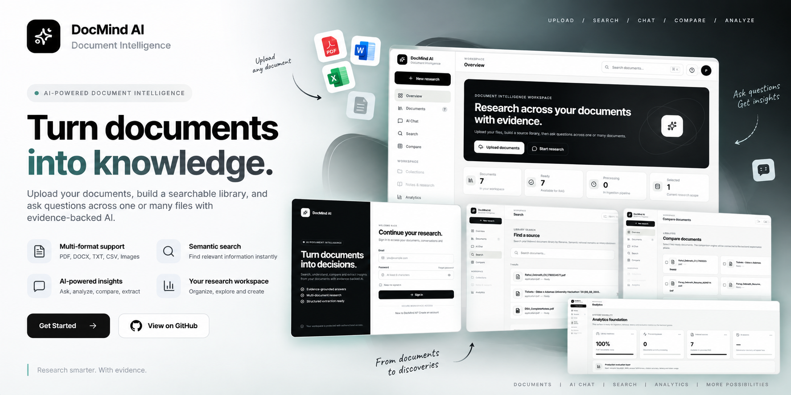
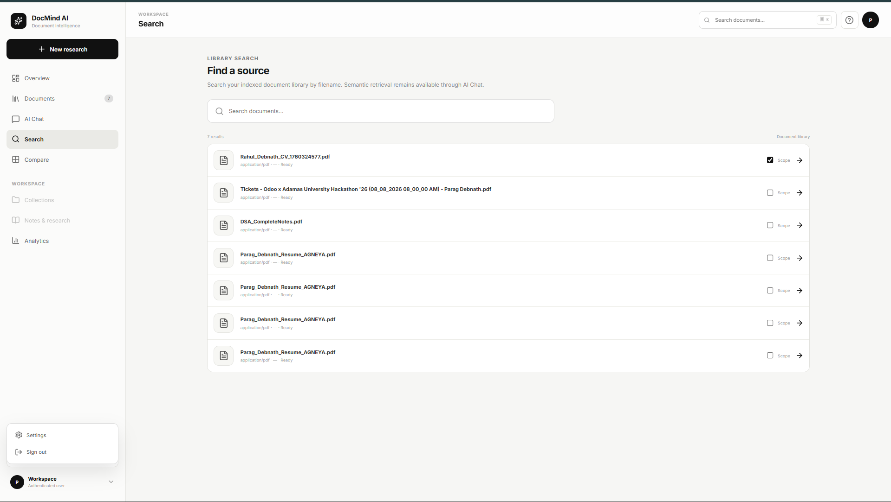
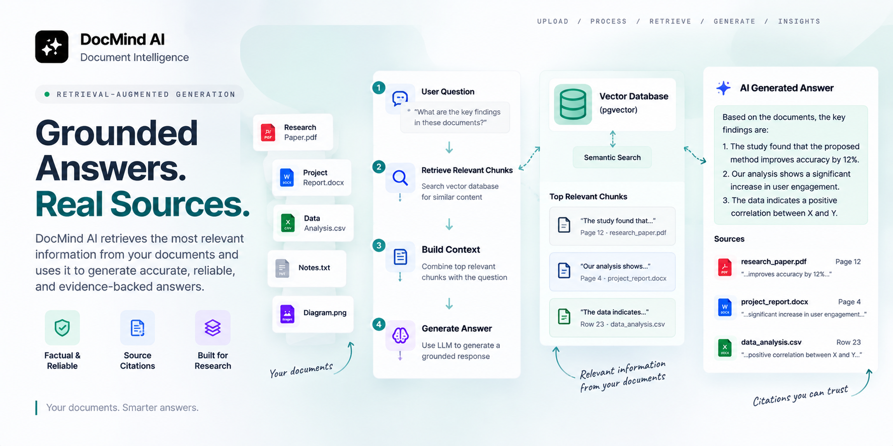
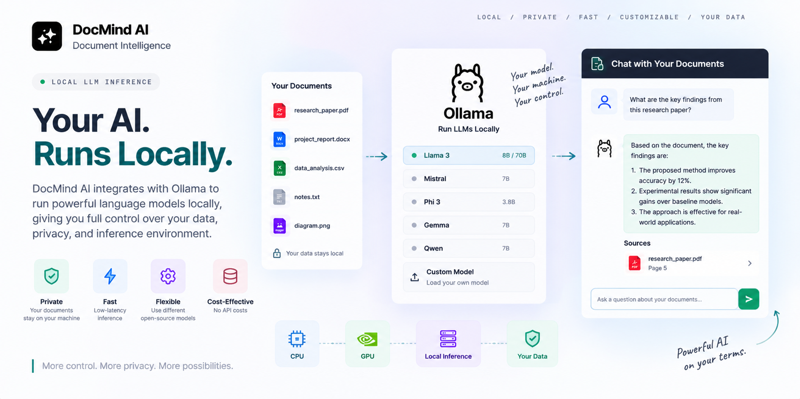
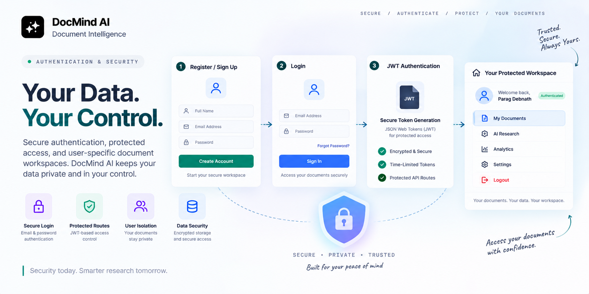
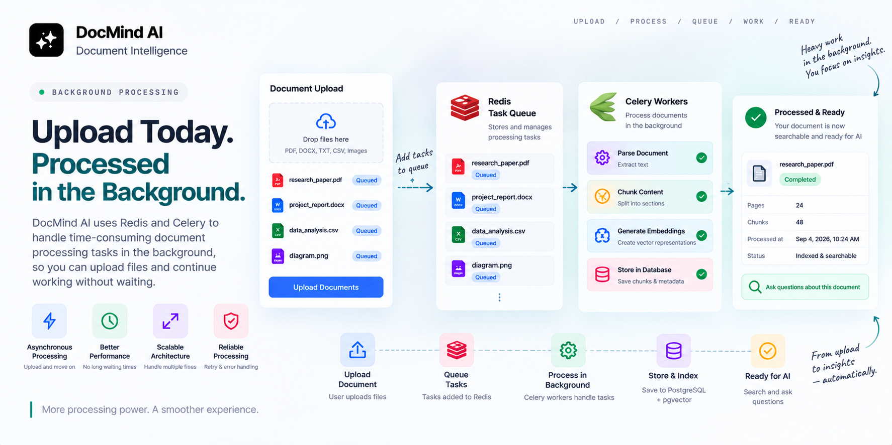
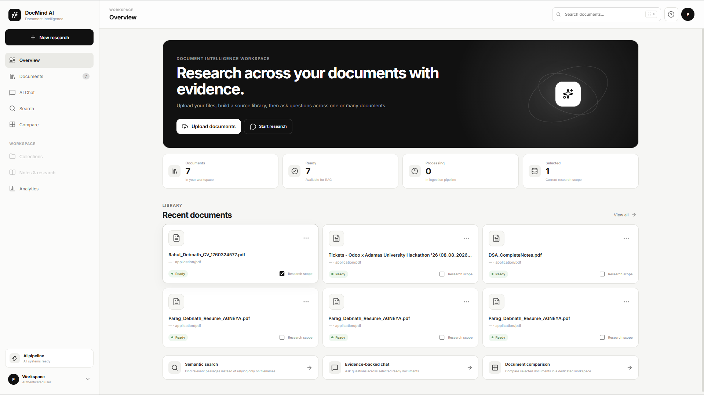
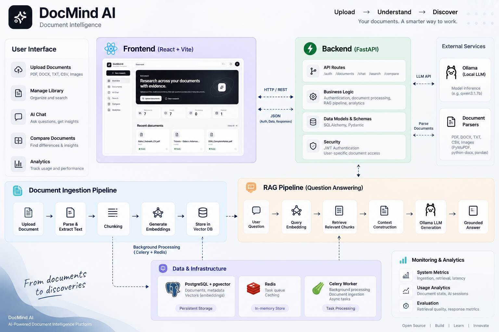

# 🧠 DocMind AI

### AI-Powered Document Intelligence & Research Workspace

<p align="center">
  
</p>

<p align="center">
  <strong>Turn documents into knowledge with evidence-backed AI.</strong>
</p>

<p align="center">
  Upload • Search • Research • Compare • Analyze
</p>

<p align="center">
  <a href="https://github.com/parag-debnath/DocMind-AI">
    
  </a>
  <a href="https://github.com/parag-debnath/DocMind-AI">
    
  </a>
  
  
  
  
  
</p>

---

## 🚀 What is DocMind AI?

**DocMind AI** is a full-stack AI Document Intelligence Platform designed to transform unstructured documents into an interactive and searchable knowledge base.

Instead of manually searching through large documents, users can upload their files, process their content, search for relevant information, and interact with their documents using AI-powered retrieval.

The platform combines:

- Document processing
- Semantic search
- Vector embeddings
- Retrieval-Augmented Generation (RAG)
- Local LLM inference
- User authentication
- Background processing
- Document analytics

 
into a unified research workspace.

---

# ✨ Key Features

## 📄 Multi-Format Document Processing

<p align="center">
  

Process multiple document formats through a unified document ingestion pipeline.

Supported formats include:

- PDF
- DOCX
- TXT
- CSV
- Image files

The ingestion architecture is designed to make it easy to add additional parsers and document processing capabilities in future iterations.

---

## 🔎 Semantic Search

<p align="center">
  
</p>

Search across your indexed document library using semantic retrieval instead of relying only on exact keyword matches.

DocMind AI converts queries into vector representations and compares them against stored document embeddings to retrieve the most relevant information.

The search workflow is designed to help users quickly discover relevant sources and continue deeper research using AI.


---

## 🤖 Retrieval-Augmented Generation

<p align="center">
  
</p>


DocMind AI uses a Retrieval-Augmented Generation (RAG) pipeline to answer questions using relevant information retrieved from the user's documents.

The system first retrieves relevant document chunks, constructs the required context, and then passes that context to the configured language model for response generation.

This creates a foundation for document-grounded question answering and evidence-oriented research.

---

## 🧠 Local LLM Inference

<p align="center">
  
</p>

DocMind AI integrates with Ollama to support local language-model inference.

This allows the application to perform AI-powered document analysis locally during development without requiring every inference request to be sent to a hosted model provider.

The LLM model and Ollama endpoint can be configured through environment variables.

---

## 🔐 Authentication & Security

<p align="center">
  
</p>


DocMind AI includes authentication and protected API workflows to keep user data isolated.

The backend provides user registration, login, JWT-based authentication, protected routes, and user-specific document access.

This ensures that documents and research data are associated with the authenticated user.

---

## ⚡ Background Processing

<p align="center">
  
</p>

Document ingestion can involve computationally expensive operations such as parsing, chunking, and embedding generation.

DocMind AI uses Redis and Celery to provide background task processing, allowing longer-running operations to be handled independently from the main API request lifecycle.

This architecture provides a foundation for scalable document ingestion as the platform grows.

---

## 🗄️ Vector Database

<p align="center">
  
</p>

DocMind AI uses PostgreSQL with pgvector to store document data, chunks, and vector embeddings.

This allows structured application data and semantic vector representations to coexist within the same database infrastructure.

Vector similarity search provides the retrieval foundation used by the RAG pipeline.

---

## 🏗️ System Architecture

<p align="center">
  
</p>

DocMind AI follows a modular full-stack architecture designed to separate the user interface, API layer, document processing pipeline, data storage, retrieval system, background workers, and local LLM inference.

The frontend communicates with the FastAPI backend through REST APIs. The backend manages authentication, document operations, AI workflows, and communication with the underlying data and processing services.

Document processing is handled through a dedicated ingestion pipeline that parses uploaded files, extracts content, splits documents into meaningful chunks, generates embeddings, and stores the resulting data in PostgreSQL with pgvector.

Long-running processing tasks are delegated to Celery workers through Redis, allowing document ingestion and embedding generation to run asynchronously without blocking the main API.

For AI-powered responses, the RAG pipeline retrieves relevant document chunks from the vector database and provides the retrieved context to the configured local LLM through Ollama.

### Architecture Components

| Component | Responsibility |
|---|---|
| React + TypeScript | Frontend user interface |
| FastAPI | REST API and application logic |
| PostgreSQL | Persistent application data |
| pgvector | Vector embeddings and similarity search |
| Redis | Task queue and supporting infrastructure |
| Celery | Background document processing |
| Ollama | Local LLM inference |
| Docker | Application containerization |

### High-Level Flow

```text
User
 │
 ▼
React + TypeScript
 │
 │ REST API
 ▼
FastAPI Backend
 │
 ├──────────────► Authentication
 │
 ├──────────────► Document Management
 │
 ├──────────────► RAG Pipeline
 │
 └──────────────► Background Tasks
                       │
                       ▼
                 Redis + Celery
                       │
                       ▼
              Document Processing
                       │
             ┌─────────┴─────────┐
             ▼                   ▼
       Embeddings           Metadata
             │                   │
             └─────────┬─────────┘
                       ▼
               PostgreSQL
                  + pgvector
                       │
                       ▼
                Semantic Retrieval
                       │
                       ▼
                  Ollama LLM
                       │
                       ▼
                AI Response
